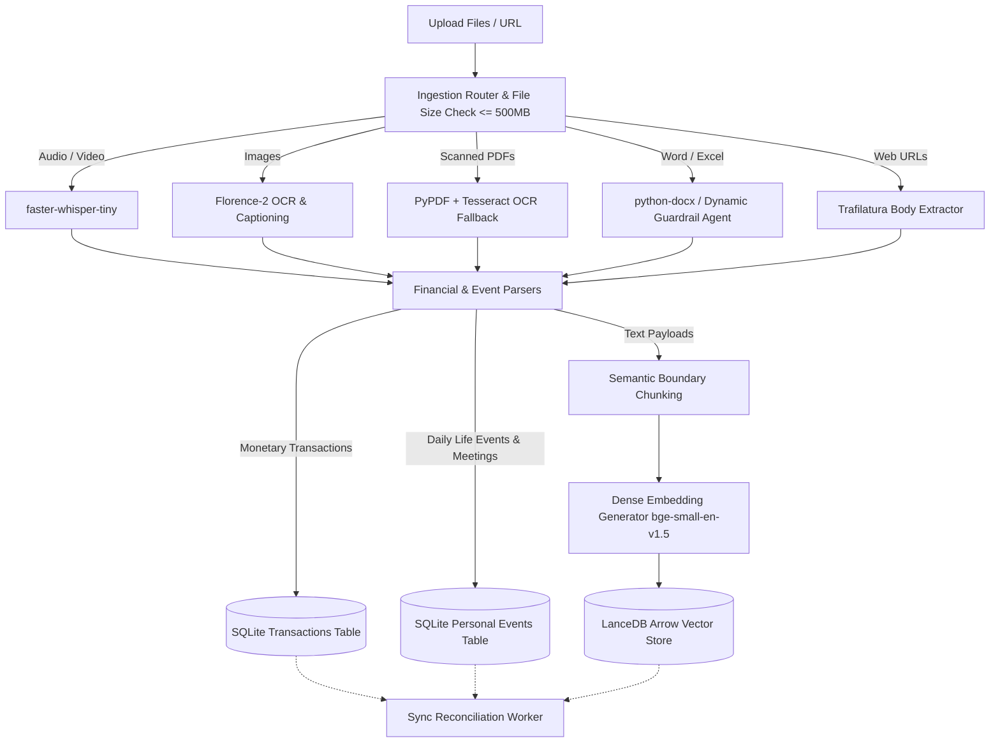
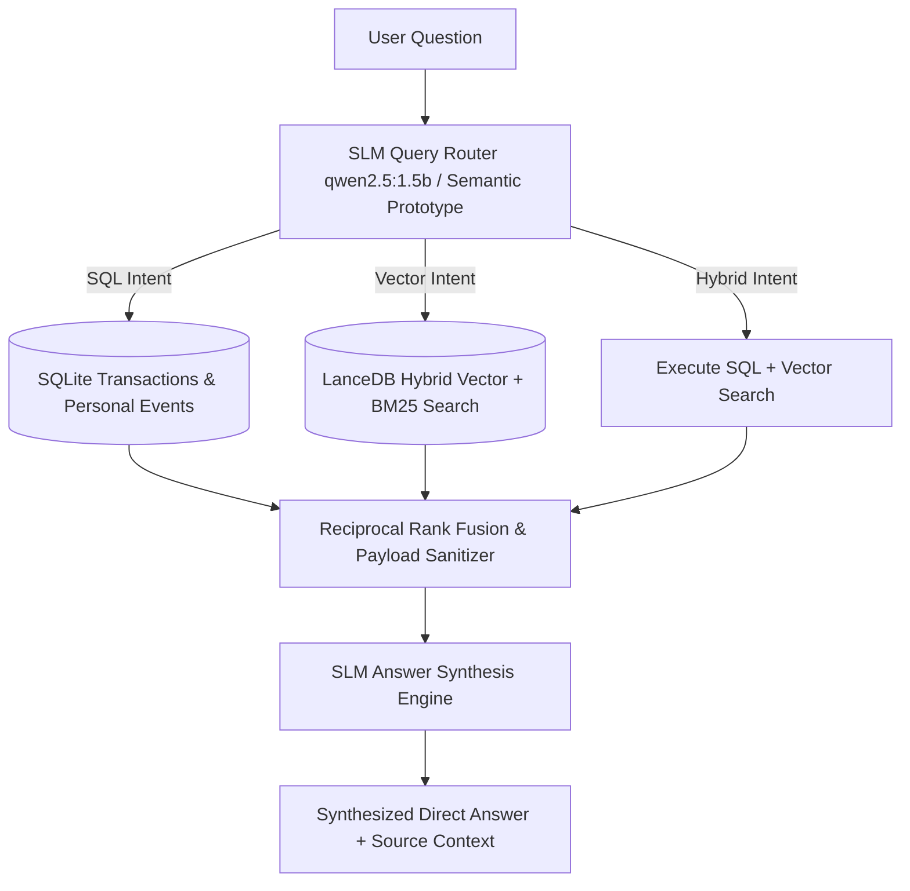

# 🌱 LifeTrace AI

A Private Multimodal Intelligence System, Personal Life Ledger & Expense Tracker powered by FastAPI, Streamlit, LanceDB, and SQLite.

📖 **[System Architecture & Design Specifications](docs/ARCHITECTURE.md)** | **[HKUDS RAG-Anything Feasibility Evaluation](docs/RAG_ANYTHING_ANALYSIS.md)**

---

## 🌟 Key Features

* **💬 Multimodal Agentic RAG Chat**: Ask natural language questions about your documents, notes, audio transcripts, scanned receipts, images, or debts/events.
* **📅 Personal Life Ledger & Daily Log**: Automatically extract and manually log daily life events, meeting notes, travel itineraries, health checkups, reminders, and milestones.
* **💸 Financial Expenses & Debt Tracker**: Structured relational tracking for payments, debts, and expense statements with zero false positives.
* **📸 Scanned PDF & Image OCR**: Automatic Tesseract OCR fallback for scanned image PDFs and receipts, plus Florence-2 scene captioning.
* **🤖 Dynamic Guardrail & Self-Learning Ingestion Agent**: Inspects magic bytes and learns rules dynamically for unhandled file extensions (`.xlsx`, `.pptx`, `.docx`, etc.).
* **📁 Batch Multi-File Ingestion**: Upload multiple files (PDFs, Word documents, text notes, images, audio) simultaneously with background async indexing.
* **⚡ 4GB RAM Baseline Ceiling**: Memory-constrained architecture enforcing strict 4GB RAM limits, file size caps (500MB max), and automated garbage collection.

---

## 🚀 Quick Start

### 1. Installation & Environment Setup

Ensure you have Python 3.11+ installed.

```bash
# Create and activate virtual environment
python3 -m venv .venv
source .venv/bin/activate

# Install dependencies
pip install -r requirements.txt
```

---

## 🏃 Running the Application

### ⚡ Starting the Backend (FastAPI)

Run the FastAPI server using Uvicorn:

```bash
uvicorn src.backend.main:app --reload --port 8000
```

- **Backend API Base URL**: `http://localhost:8000/api/v1`
- **Interactive API Docs (Swagger UI)**: `http://localhost:8000/docs`
- **Health Check**: `http://localhost:8000/api/v1/health`

---

### 🎨 Starting the Frontend (Streamlit)

In a separate terminal window (with the virtual environment activated), start the Streamlit app:

```bash
streamlit run src/frontend/app.py
```

- **Frontend Dashboard**: `http://localhost:8501`

---

## 🏗️ Indexing & Retrieval Architecture Patterns

This application implements core design patterns for low-resource multimodal processing, hybrid search, and agentic RAG retrieval.

### 📥 1. Indexing & Processing Patterns



* **Multimodal Extraction Router Pattern**:
  * **Audio/Video**: Transcribed via `faster-whisper` with timestamp logging and resumable partial transcript offset tracking.
  * **Images & Scanned PDFs**: Optical character recognition (OCR) via `Tesseract` and visual scene captioning via `Florence-2`.
  * **Documents & Office Files**: Parsed via `python-docx` and the Dynamic Guardrail Self-Learning Agent.
  * **Web URLs**: Processed via `Trafilatura` to strip DOM boilerplate and navigation bars.
* **SLM-Verified Financial & Event Extraction Pattern**:
  * Payments and life events are parsed using regular expressions and zero-shot local SLM (`Qwen-2.5-1.5B`) verification into structured relational records (`transactions` & `personal_events`) in SQLite.
* **Semantic Sentence-Boundary Chunking Pattern**:
  * Text is split using sliding window sentence boundaries, preserving source metadata before generating 384-dimensional dense vectors (`BAAI/bge-small-en-v1.5`).
* **Dual-Store Event-Driven Reconciliation Pattern**:
  * Relational metadata is stored in SQLite while vector embeddings are stored in disk-backed LanceDB Arrow tables. A background worker (`sync_worker.py`) reconciles any `UNINDEXED` or `SYNC_FAILED` documents asynchronously.
* **Memory Ceiling Enforcement Pattern**:
  * Enforces a strict 4GB RAM ceiling with pre-ingestion file size checks (500MB max), device acceleration auto-detection (MPS/CUDA/CPU), and explicit garbage collection sweeps.

---

### 🔍 2. Retrieval & Querying Patterns (Agentic RAG)



* **Dynamic SLM Query Router Pattern**:
  * Classifies questions via local `Qwen-2.5-1.5B` (Ollama) or semantic embedding prototype matcher into three execution paths (`SQL`, `VECTOR`, `HYBRID`).
* **Hybrid Search (Dense Vector + Sparse BM25 Fusion) Pattern**:
  * Merges dense vector semantic similarity with sparse BM25 token matching using **Reciprocal Rank Fusion (RRF)**:
    $$RRF\_Score(d) = \sum_{m \in M} \frac{1}{k + r_m(d)} \quad (k=60)$$
* **Generative SLM Answer Synthesis Pattern**:
  * Passes retrieved document chunks, transaction records, and personal event logs to the local SLM (`qwen2.5:1.5b`) to synthesize direct, natural language answers.

---

## 🛠️ Running Tests

To run the automated test suite:

```bash
pytest
```

---

## 📁 Project Structure

```text
PersonalRag/
├── src/
│   ├── backend/
│   │   ├── database/       # SQLite & LanceDB storage handlers
│   │   ├── ingestion/      # Multi-modal parsers (PDF OCR, Audio, Images, DOCX, Events, Finance)
│   │   ├── models/         # Pydantic schemas
│   │   ├── query/          # Search engine & SLM router logic
│   │   ├── services/       # Core application services & sync worker
│   │   ├── utils/          # Memory ceiling & health utilities
│   │   └── main.py         # FastAPI application entry point
│   └── frontend/
│       └── app.py          # Streamlit UI dashboard
├── specs/                  # Specifications, data models, tasks, and walkthroughs
├── tests/                  # Unit and integration tests (26 passing tests)
├── pyproject.toml          # Project configuration & dependencies
├── requirements.txt       # Dependency requirements
└── README.md
```
