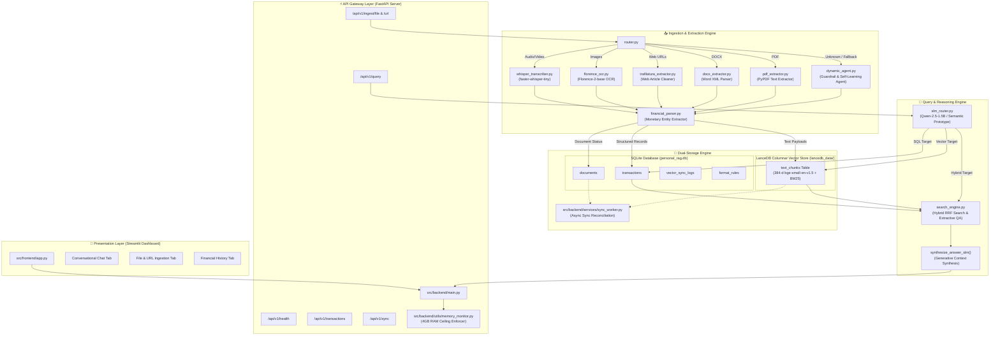
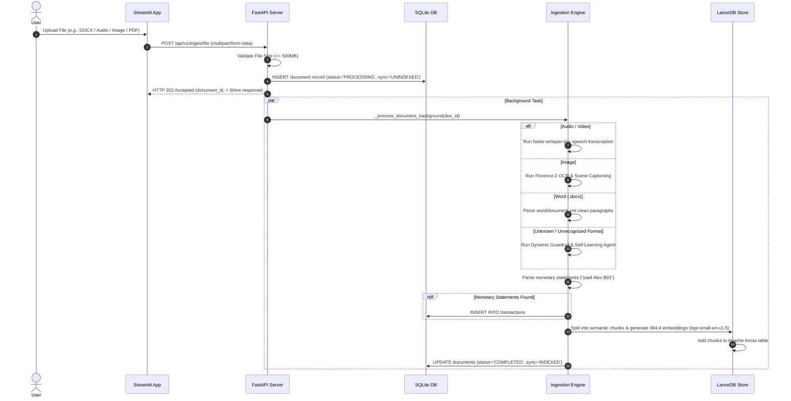
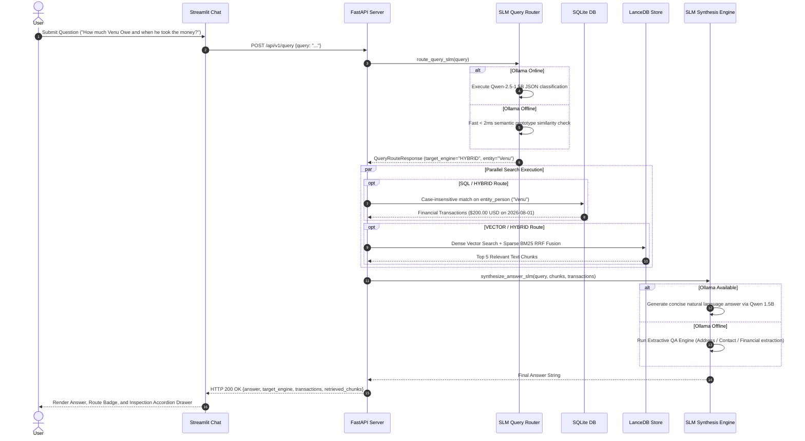
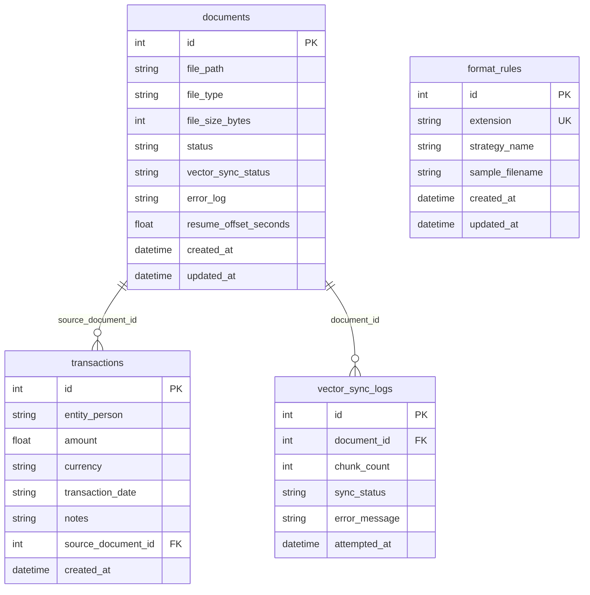

# 🏗️ System Architecture & Design Documentation

**Project**: Personal RAG — Low-Resource Multimodal Intelligence System & Expense Tracker  
**Target RAM Constraint**: Max 4GB Total RAM Ceiling  
**Frameworks**: FastAPI, Streamlit, LanceDB (Apache Arrow), SQLite, Pydantic v2, PyTorch/MPS  

---

## 1. High-Level Architecture Overview

The Personal RAG system employs a dual-storage architecture that decouples relational metadata & structured financial transactions from high-dimensional dense vector embeddings and BM25 sparse keyword indices.

---

## 2. Ingestion Pipeline Sequence Flow

---

## 3. Query & RAG Reasoning Sequence Flow

---

## 4. Storage & Schema Specifications

### 4.1 SQLite Relational Schema (`personal_rag.db`)

### 4.2 LanceDB Columnar Arrow Table Schema (`text_chunks`)

| Field Name | Type | Description |
| :--- | :--- | :--- |
| `vector` | `FixedSizeList[Float32, 384]` | 384-dimensional dense vector (`BAAI/bge-small-en-v1.5`) |
| `id` | `String` | Unique chunk UUID |
| `document_id` | `Int64` | Foreign key referencing `documents.id` |
| `chunk_index` | `Int32` | Sequential index of chunk within document |
| `text_content` | `String` | Raw text payload of the chunk |
| `bm25_tokens` | `String` | Lowercase normalized space-separated tokens for BM25 matching |
| `source_type` | `String` | Document type category (`text`, `pdf`, `docx`, `audio`, `image`, `web`) |
| `timestamp_start` | `Float32` | Audio/video start timestamp offset (in seconds) |
| `timestamp_end` | `Float32` | Audio/video end timestamp offset (in seconds) |
| `created_at` | `String` | ISO timestamp |

---

## 5. Architectural Design Patterns Summary

| Pattern Name | Location | Description |
| :--- | :--- | :--- |
| **Multimodal Router** | [router.py](file:///Users/muralidupati/PersonalRag/src/backend/ingestion/router.py) | Directs incoming files to specialized extractors (Whisper, Florence-2, Trafilatura, DOCX parser). |
| **Dynamic Guardrail Agent** | [dynamic_agent.py](file:///Users/muralidupati/PersonalRag/src/backend/ingestion/dynamic_agent.py) | Inspects magic bytes, prevents raw binary garbled dumps, and self-learns strategies for unknown formats in SQLite. |
| **Dual-Store Reconciliation** | [sync_worker.py](file:///Users/muralidupati/PersonalRag/src/backend/services/sync_worker.py) | Asynchronously reconciles `UNINDEXED` or `SYNC_FAILED` documents into LanceDB without blocking users. |
| **Dynamic SLM Query Router** | [slm_router.py](file:///Users/muralidupati/PersonalRag/src/backend/query/slm_router.py) | Classifies user queries into `SQL`, `VECTOR`, or `HYBRID` routes via Qwen 1.5B or < 2ms semantic prototypes. |
| **Reciprocal Rank Fusion (RRF)** | [lancedb_store.py](file:///Users/muralidupati/PersonalRag/src/backend/database/lancedb_store.py) | Combines dense vector semantic similarity with sparse BM25 keyword matching ($k=60$). |
| **Extractive & Generative QA** | [search_engine.py](file:///Users/muralidupati/PersonalRag/src/backend/query/search_engine.py) | Generates natural language answers via local SLM or extracts targeted addresses/contacts when SLM is offline. |
| **4GB Memory Ceiling Enforcer** | [memory_monitor.py](file:///Users/muralidupati/PersonalRag/src/backend/utils/memory_monitor.py) | Enforces memory ceilings, size caps (500MB), and triggers proactive garbage collection sweeps. |
