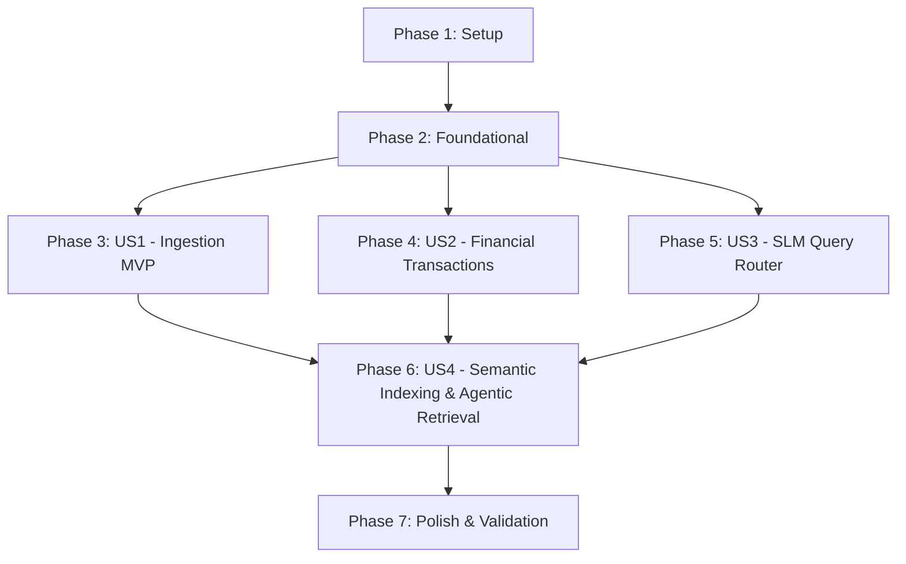

# Tasks: Multimodal Personal RAG System

**Input**: Design documents from `/specs/001-multimodal-personal-rag/`

**Prerequisites**: `plan.md`, `spec.md`, `research.md`, `data-model.md`, `contracts/api-spec.json`, `quickstart.md`

**Tests**: Test tasks included following the TDD workflow mandated by project Constitution (Principle V).

**Organization**: Tasks are grouped by user story (US1, US2, US3) to enable independent implementation and testing.

---

## Task Format & Legend

- **`- [ ] [TaskID]`**: Markdown checkbox with sequential ID
- **`[P]`**: Task can run in parallel (different files, no blocking dependencies)
- **`[US1]`, `[US2]`, `[US3]`**: User story label mapping task to feature spec requirement

---

## Phase 1: Setup (Shared Infrastructure)

**Purpose**: Project initialization, directory layout, and core dependency configuration.

- [x] T001 Create backend, frontend, and test directory structures in `src/backend/`, `src/frontend/`, and `tests/`
- [x] T002 Initialize Python 3.11 dependency configuration in `pyproject.toml` and `requirements.txt`
- [x] T003 [P] Configure `ruff` linting and strict `mypy` type checking in `pyproject.toml`

---

## Phase 2: Foundational (Blocking Prerequisites)

**Purpose**: Core database schemas, Pydantic contracts, and RAM memory monitor blocking all downstream user stories.

**⚠️ CRITICAL**: Must complete before user story implementation begins.

- [x] T004 Implement Pydantic v2 core schemas (`FinancialTransactionCreate`, `QueryRouteResponse`, `DocumentResponse`) in `src/backend/models/pydantic_schemas.py`
- [x] T005 [P] Initialize SQLite schema (`transactions`, `documents`, `vector_sync_logs`) and DAO connection manager in `src/backend/database/sqlite.py`
- [x] T006 [P] Initialize LanceDB database and Apache Arrow `text_chunks` table schema in `src/backend/database/lancedb_store.py`
- [x] T007 Implement RAM memory monitor enforcing max 4GB RAM ceiling in `src/backend/utils/memory_monitor.py`
- [x] T008 [P] Initialize FastAPI REST application with CORS and `/api/v1/health` endpoint in `src/backend/main.py`

**Checkpoint**: Foundation complete. User story implementation can proceed.

---

## Phase 3: User Story 1 - Multimodal Ingestion & Processing (Priority: P1) 🎯 MVP

**Goal**: Ingest text documents, web URLs, audio/video files, and images into searchable text chunks and indexed LanceDB vector storage.

**Independent Test**: Ingest sample text files, web URLs, audio notes, and image files, verifying clean text extraction, SQLite document status updates, and LanceDB Arrow table vector indexing.

### Tests for User Story 1

- [x] T009 [P] [US1] Unit test for 500MB upload file size cap and file router in `tests/unit/test_ingestion_router.py`
- [x] T010 [P] [US1] Unit test for `faster-whisper` speech transcription and offset recovery in `tests/unit/test_whisper_transcriber.py`
- [x] T011 [P] [US1] Unit test for `Florence-2` OCR and image captioning in `tests/unit/test_florence_ocr.py`
- [x] T012 [P] [US1] Unit test for `Trafilatura` web text scraper in `tests/unit/test_trafilatura_extractor.py`

### Implementation for User Story 1

- [x] T013 [US1] Implement file size validator (500MB max, raising `FILE_TOO_LARGE`) and file extension router in `src/backend/ingestion/router.py`
- [x] T014 [P] [US1] Implement `faster-whisper-tiny` speech transcriber with timestamp logging and resumable offset support in `src/backend/ingestion/whisper_transcriber.py`
- [x] T015 [P] [US1] Implement `Florence-2-base` OCR text extraction and image captioning in `src/backend/ingestion/florence_ocr.py`
- [x] T016 [P] [US1] Implement web URL article text scraper in `src/backend/ingestion/trafilatura_extractor.py`
- [x] T017 [US1] Implement text chunking and `bge-small-en-v1.5` 384-d dense embedding generation in `src/backend/database/lancedb_store.py`
- [x] T018 [US1] Expose POST `/api/v1/ingest/file` and POST `/api/v1/ingest/url` endpoints in `src/backend/main.py`
- [x] T019 [US1] Implement file upload and URL submission tab in `src/frontend/app.py`

**Checkpoint**: User Story 1 (MVP) functional and testable independently.

---

## Phase 4: User Story 2 - Financial Transaction Extraction & Structured Querying (Priority: P2)

**Goal**: Parse monetary statements (e.g. "paid Alex $50") directly into structured SQLite records and enable tabular querying.

**Independent Test**: Process monetary statements, assert SQLite `transactions` records are populated with correct amounts, currencies, and counterparties, and query aggregate payment sums.

### Tests for User Story 2

- [x] T020 [P] [US2] Unit test for monetary pattern extraction ("paid Alex $50 for dinner") in `tests/unit/test_financial_parser.py`
- [x] T021 [P] [US2] Unit test for SQLite transactions DAO methods in `tests/unit/test_sqlite_dao.py`

### Implementation for User Story 2

- [x] T022 [US2] Implement monetary statement parser combining regex rules and Pydantic schema validation in `src/backend/ingestion/financial_parser.py`
- [x] T023 [US2] Implement transaction CRUD and aggregate sum queries in `src/backend/database/sqlite.py`
- [x] T024 [US2] Expose GET/POST `/api/v1/transactions` REST endpoints in `src/backend/main.py`
- [x] T025 [US2] Implement financial transactions history table view and manual entry form in `src/frontend/app.py`

**Checkpoint**: User Stories 1 AND 2 functional independently.

---

## Phase 5: User Story 3 - SLM Query Routing & Hybrid Search (Priority: P3)

**Goal**: Route natural language questions via local Qwen-2.5-1.5B into SQL, LanceDB vector + BM25 hybrid search, or combined execution paths.

**Independent Test**: Submit financial, document semantic, and hybrid questions; assert router selects target engine (`SQL`, `VECTOR`, or `HYBRID`) and returns accurate answers.

### Tests for User Story 3

- [x] T026 [P] [US3] Unit test for Ollama SLM query router classification in `tests/unit/test_slm_router.py`
- [x] T027 [P] [US3] Integration test for LanceDB dense vector + BM25 Reciprocal Rank Fusion search in `tests/integration/test_hybrid_search.py`

### Implementation for User Story 3

- [x] T028 [US3] Implement `Qwen-2.5-1.5B` Ollama query classification prompt and JSON parser in `src/backend/query/slm_router.py`
- [x] T029 [US3] Implement unified search engine orchestrating SQLite SQL execution and LanceDB vector + BM25 search in `src/backend/query/search_engine.py`
- [x] T030 [US3] Expose POST `/api/v1/query` endpoint in `src/backend/main.py`
- [x] T031 [US3] Implement interactive chat interface with route path badges (`SQL`, `VECTOR`, `HYBRID`) in `src/frontend/app.py`

**Checkpoint**: All user stories functional independently.

---

## Phase 6: User Story 4 - Semantic Indexing & Agentic AI Retrieval Patterns (Priority: P2)

**Goal**: Implement sentence-boundary semantic chunking during indexing and agentic retrieval patterns (multi-step query decomposition, self-correcting query reformulation, and SLM generative answer synthesis).

**Independent Test**: Submit complex multi-part questions, verify query decomposition into sub-queries, query reformulation on low confidence, and SLM answer synthesis.

### Tests for User Story 4

- [x] T035 [P] [US4] Unit test for FastAPI search result JSON serialization in `tests/unit/test_search_serialization.py`
- [ ] T036 [P] [US4] Unit test for semantic chunking and agentic query decomposition in `tests/unit/test_agentic_retriever.py`

### Implementation for User Story 4

- [ ] T037 [US4] Implement sentence-boundary semantic chunking and metadata tagging during text ingestion in `src/backend/database/lancedb_store.py` and `src/backend/main.py`
- [x] T038 [US4] Implement SLM generative answer synthesis from retrieved document context in `src/backend/query/search_engine.py`
- [ ] T039 [US4] Implement agentic multi-step query decomposition, iterative re-ranking, and self-correcting query reformulation loop in `src/backend/query/search_engine.py`

---

## Phase 7: Polish & Cross-Cutting Concerns

**Purpose**: System reconciliation workers, memory benchmarks, and end-to-end quickstart validation.

- [x] T040 [P] Implement background sync worker for `SYNC_FAILED` LanceDB vector reconciliation in `src/backend/services/sync_worker.py`
- [x] T041 Integration test verifying max 4GB RAM memory ceiling compliance under concurrent operations in `tests/integration/test_memory_ceiling.py`
- [x] T042 Execute end-to-end quickstart validation scenarios in `specs/001-multimodal-personal-rag/quickstart.md`

---

## Dependencies & Execution Order

### Story Completion Order

### Parallel Opportunities

- **Setup Phase**: T003 can run in parallel with T001/T002.
- **Foundational Phase**: T005, T006, and T008 can run in parallel after T004 schemas are created.
- **US1 Tests & Impl**: T009–T012 unit tests and T014–T016 extractors can run in parallel.
- **US2 & US3 Unit Tests**: T020, T021, T026, and T027 can run in parallel.
- **US4 Tests & Impl**: T035–T036 unit tests can run in parallel with T037–T039 implementations.

